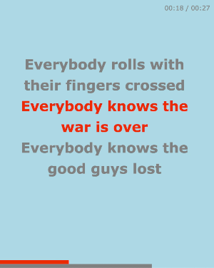

<!-- Improved compatibility of back to top link: See: https://github.com/othneildrew/Best-README-Template/pull/73 -->
<a id="readme-top"></a>
<!--
*** Thanks for checking out the Best-README-Template. If you have a suggestion
*** that would make this better, please fork the repo and create a pull request
*** or simply open an issue with the tag "enhancement".
*** Don't forget to give the project a star!
*** Thanks again! Now go create something AMAZING! :D
-->


<!-- PROJECT LOGO -->
<div align="center">
<h3 align="center">KaraokeJS</h3>
    <p align="center">
        A simple Node application that generates a '.webm' video for a given set of lyrics, based on an input .lrc file.
    </p>
</div>
    
<br />

## About The Project

This project aims to be a simple tool where one can generate a Karaoke video from an input ['.lrc'](https://en.wikipedia.org/wiki/LRC_(file_format)) lyrics file. It outputs a '.webm' video, which should be viewable on all modern web browsers, as well as working on Instagram and Youtube.

The default video size is 1080x1350px, which is the default size required by Instagram. The default font for the lyrics is 70px (changeable), while the timer font is 32px (currently fixed).

### Built With/Min Requirements

* Node v18
* Git
* Vanilla Javascript


## Installation

To get set up, you simply need to clone the repository, then install it globally:
```sh
git clone https://github.com/drcoen/karaokejs.git .
npm install
npm install -g . # makes 'karaokejs' available on the CLI
```

## Usage
### Sample Commands
```sh
# create video ./karaoke.webm, based on the contents of ./filename.lrc
karaokejs -f filename.lrc 

# create video ./mysong.webm with yellow background, green text and no timer
karaokejs -f mysong.lrc -o mysong.webm --bg-color yellow --active-color '#0f0' --hide-timer

# use a custom font from Google
karaokejs -f mysong.lrc --font-family Handjet --font-url https://fonts.gstatic.com/s/nerkoone/v16/m8JQjfZSc7OXlB3ZMOjDd5RARGmK3Q.woff2

# hide status bar
karaokejs -f mysong.lrc --status-bar-height 0

# get help see all options
karaokejs --help
```
(if you don't want to install globally, replace `karaokejs` with `node .` above, assuming you're in the karaokejs directory)

The video generation process takes at least as long as the song itself, since the whole thing needs to render in real-time. So, if your song is 5 minutes long, be prepared to wait 5 minutes!

### File format
A sample lyric file is provided, see [sample.lrc](sample.lrc) (the first verse of 'Everybody Knows' by Leonard Cohen!). The file must contain only lines of the format `[hh:ss.mss]lyric text` and ideally the last line should be something like
```
[01:02:000](end)
```
to show that the song ends after 1 minute and 2 seconds; otherwise it assumes the last lyric is when the song ends and thus so does the video.

_Normally, there can be other data in a .lrc file, however the application currently doesn't support those lines, and throws an Error rather than skipping over any malformatted line._

### Sample Video
You can download the video for the sample.lrc provided at [https://www.dropbox.com/scl/fi/aafvqpxoj3na3fu7s62i7/karaoke.webm?rlkey=wj5d8r9kjrhjj0ujmnkxpmhc6&e=1&st=ovnwtm3e&dl=1](https://www.dropbox.com/scl/fi/aafvqpxoj3na3fu7s62i7/karaoke.webm?rlkey=wj5d8r9kjrhjj0ujmnkxpmhc6&e=1&st=ovnwtm3e&dl=1).

### Sample Screenshot


## Contributing

Contributions are what make the open source community such an amazing place to learn, inspire, and create. Any contributions you make are **greatly appreciated**.

If you have a suggestion that would make this better, please fork the repo and create a pull request. You can also simply open an issue with the tag "enhancement".
Don't forget to give the project a star! Thanks again!

1. Fork the Project
2. Create your Feature Branch (`git checkout -b feature/AmazingFeature`)
3. Commit your Changes (`git commit -m 'Add some AmazingFeature'`)
4. Push to the Branch (`git push origin feature/AmazingFeature`)
5. Open a Pull Request

## License
Distributed under the GPL v3 License.

## Contact
David Coen - [https://www.drcoen.com](https://www.drcoen.com)

Project Link: [https://github.com/drcoen/karaokejs](https://github.com/drcoen/karaokejs)
